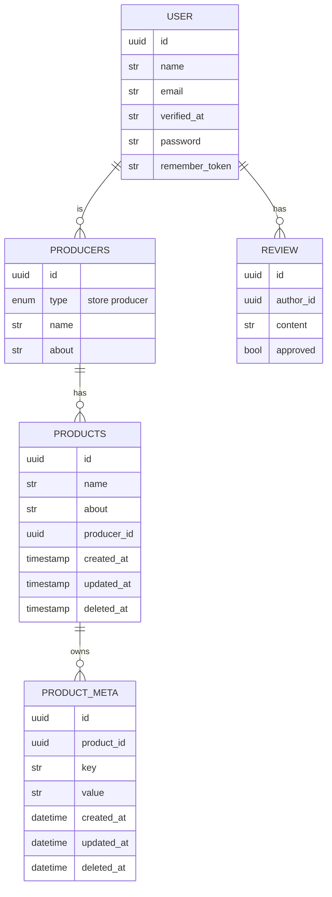

# wiri backend
this is the backend of wiri, It handles all of our request. the setup is just like any other basic laravel app.

## setup
install the packages using `composer install` and then copy the .env.example to .env. 

## boring design shit
models: 
    - users 
    - companies(stores, growers, transporters)
    - products(concentrates,buds, rolling paper)
    - reviews/comments

## docs
you can generate docs with `php artisan scribe:generate`

### db schema

## todo
- [x] create user model
- [x] create company model that links to user
- [ ] create product model
- [ ] create review 
- [ ] implement auth for company
- [ ] implement auth for review
- [ ] add media to company
- [ ] add media to products
- [ ] implement $user-can() in be
- [ ] do security audit of fillible fields 

## faq 
**could not find driver (Connection: sqlite, SQL: PRAGMA foreign_keys = ON;)**
you need to install the php-sqlite extension